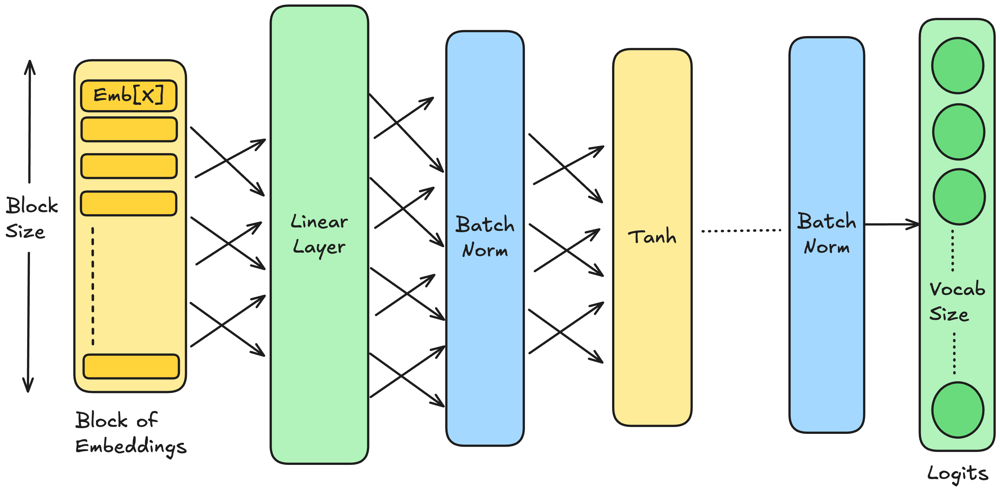

# Deep Learning 101 [DL-101]
## Everything you need to learn to train Deep Neural Nets 

The repository holds the implementation of technical concepts involved the Deep Learning domain. We opt a practical approach of learning where we create a character level generation model from scratch and use it to generate more similar and new examples from a given dataset.

## Understanding the Problem Statement

We have a [dataset](https://gist.github.com/mbejda/7f86ca901fe41bc14a63) `Indian Male Names` csv file having `~15K` names. Now the idea is to feed these example names into the created Character level generation model and generate more names like these which should probably be new and not present in the dataset.

```
barjraj
ramdin verma
sharat chandran
birender mandal
amit
kushal
kasid
shiv prakash
```

The implementation is influenced by:

  - Andrej's [makemore](https://github.com/karpathy/makemore/)
  - Multi Layer Perceptron (MLP) architecture, following [Bengio et al. 2003](https://www.jmlr.org/papers/volume3/bengio03a/bengio03a.pdf)
  - Wavenet, following [DeepMind WaveNet 2016](https://arxiv.org/abs/1609.03499) (in progress...)


## Topics Covered

1. Building the Deep Neural Net architecture.
2. Training the Neural Net
    - Evaluating Dev and Test Losses
    - Inference (Prediction)
3. L2 Regularization
4. Drop-out Regularization
5. Vanishing / Exploding Gradients
6. Gradient Descent with Momentum
7. RMS Prop
8. Adam Optimization 
9. Batch Normalization (Batch Norm)
10. Early Stopping
11. Conclusions

## Building the Deep Neural Net architecture

The architecture of our Deep Neural Network looks like this.

```python
[
  Linear(N_EMBED * BLOCK_SIZE, N_HIDDEN, bias=False), BatchNorm1d(N_HIDDEN), Tanh(),
  Linear(            N_HIDDEN, N_HIDDEN, bias=False), BatchNorm1d(N_HIDDEN), Tanh(),
  Linear(            N_HIDDEN, N_HIDDEN, bias=False), BatchNorm1d(N_HIDDEN), Tanh(),
  Linear(            N_HIDDEN, N_HIDDEN, bias=False), BatchNorm1d(N_HIDDEN), Tanh(),
  Linear(            N_HIDDEN, N_HIDDEN, bias=False), BatchNorm1d(N_HIDDEN), Tanh(),
  Linear(            N_HIDDEN, vocab_size, bias=False), BatchNorm1d(vocab_size),
]
```

Our Layer comprises of alternating `Linear`, `BatchNorm` and `Tanh` components. The last layer has an output of `vocab_size` so that we can understand the probabilities of each character after the forward pass. Also the model learns about these prediction / probabilities during the back-prop.

Let's visualize the Neural Net architecture.




## Training the Neural Network

We have a dataset of Indian Male names comprising of around `15K` names. We break this down into a character set of 3 characters which act as a context followed by a target character. This was achieved through a rolling window approach on the names dataset where the size of window was set to 3.

With the above approach we achieved a training set of `163,500` each with a window of 3 consecutive character and hence having a shape of `163500 x 3`.

Further we use a `10 dimensional` Character embedding vector which represents each character through 10 embeddings. We use feed these embeddings in our neural net. To do that we transform  our existing training set so that each character is now represented by the corresponding 10 embedding vectors. This changes the shape of our Training dataset to `163500 x 30`.

We train the above explained neural net for around `100K` iterations. After training we achieved following losses.

  - Validation / Dev Set ~ `1.60`
  - Test Set ~ `1.63`

Post training we used the trained model to generate more words and this is how it went.

```
punal
guravinay
prakesh kumar
iman @ rahul
vish
ram
manoj kumar
rat
jai pappyp
bhagwa rampaoee @ baba prasankari
prash
ravi
narender
abhk@ afwan gupta
nadeepak
sagar  singh
navean
yogin
aehunna @ ram aja ramad ali
aruddin
vikashok kumar
rav shay kumar
```

Looking at the result above, I can say the model performed pretty decently. Some names like `manoj kumar`, `ravi`, `narender` were actual names but others generations like `punal`, `prakesh kumar`, `gurvinay` shows the model still has some shortcomings.


## L2 Regularization

L2 Regularization is a regularization technique applied to the weights of a neural network. We minimize the `Loss` function by putting penalty on the `L2 Norm` or `Forbenius Norm` of the weights.

```math
L2Norm = \sum_{l=1}^L w_L^2
```

```math
L(Ŷ, Y) = 1/m * L(Ŷ, Y) + (ƛ/2*m) * \sum_{l=1}^L w_L^2
```

where `ƛ` is the value determining the strength of the penalty. And `m` determines the training set size or the batch size.